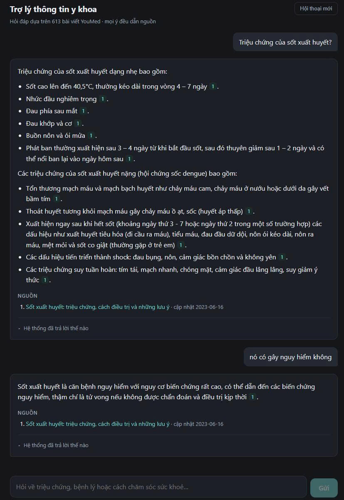

# Medical Agentic RAG

Hệ thống hỏi đáp thông tin y khoa tiếng Việt. Mọi câu trả lời chỉ dựa trên 613 bài viết YouMed
đã crawl offline, và mỗi ý đều phải dẫn nguồn kiểm chứng được.

Điểm khác với một lần gọi LLM kèm RAG thông thường: phần điều phối là một LangGraph graph có
**routing theo loại câu hỏi**, **vòng tự sửa truy vấn**, **một research agent có ngân sách cứng**,
**lớp an toàn hai tầng** cho tình huống cấp cứu, và **bộ kiểm tra trích dẫn** loại bỏ những câu
không được nguồn hỗ trợ trước khi trả về người dùng.



## Kết quả

Đo trên split `test` của bộ dữ liệu tự xây (88 câu: 50 văn nói viết tay, 14 ngoài phạm vi,
24 an toàn). Mọi tỉ lệ kèm khoảng tin cậy Wilson 95% — n ở đây nhỏ, nên khoảng tin cậy quan
trọng không kém giá trị trung tâm.

| Hạng mục | Kết quả |
|---|---|
| Tìm đúng bài (Article@5) | 0.94 [0.84–0.98] |
| Nêu đủ ý chính (`must_mention`) | 0.73 [0.60–0.84] |
| Câu y khoa có trích dẫn | 0.97 [0.94–0.99] |
| Trích dẫn đúng nguồn \* | 0.92 [0.87–0.95] |
| Từ chối nhầm (càng thấp càng tốt) | 0.08 [0.03–0.19] |
| Nói "chưa có thông tin" đúng lúc | 1.00 [0.78–1.00] |
| Bắt ca cấp cứu / tự hại | 1.00 [0.72–1.00] |
| Dừng nhầm (càng thấp càng tốt) | 0.21 [0.08–0.48] |
| Độ trễ P95 | khoảng 55s (đo khi chạy song song) |

Retrieval đo riêng trên 234 câu sinh từ chunk, phân tầng độ khó:

| | easy | medium | hard | Tổng |
|---|---|---|---|---|
| Article@5, hybrid + rerank | 0.99 | 0.99 | 0.68 | 0.89 |

Routing accuracy (phân loại câu hỏi): **0.858** trên 106 câu. 113 unit test, không cần network.

\* Faithfulness và "trích dẫn đúng nguồn" dùng LLM-as-judge **chưa hiệu chuẩn bằng người** — là
chỉ số tham khảo, không phải con số tuyệt đối. Xem phần Giới hạn.

## Kiến trúc

```
React + Vite  :5173
      |  HTTP / SSE
      v
FastAPI  :8000 ------> LangGraph graph ---+---> Qdrant :6333  (dense + sparse tiếng Việt, RRF)
                                          +---> model server :8001  (embed + rerank, GPU local)
                                          +---> LLM endpoint (gemini-2.5-flash)
                       SQLite checkpointer (hội thoại nhiều lượt)
```

- **Dense**: `google/embeddinggemma-300m` (768 chiều). **Rerank**: `BAAI/bge-reranker-v2-m3`.
  Cả hai chạy local trong `model_server/`, bfloat16 để vừa GPU 4GB.
- **Sparse tiếng Việt**: tự viết (âm tiết + bigram + bản không dấu), IDF tính trong Qdrant.
  Việc này quan trọng vì người dùng thật hay gõ không dấu.
- **Fusion**: RRF chạy trong Qdrant, không gộp ở tầng ứng dụng.

## Pipeline một lượt hỏi

```
safety_rules (rule, không LLM) --> cấp cứu / tự hại ở tình huống cá nhân --> template --> END
      |
condense_question (bỏ qua ở lượt đầu)
      |
analyze_query --> out_of_scope --> template --> END
      |   emergency dạng "kiến thức chung" thì hạ nhãn, trả lời kèm khuyến cáo 115
      v
   route theo question_type
      +- definition           -> hybrid -> rerank -> (đủ tự tin? generate : grade)
      +- section_lookup       -> khớp tên bài (fuzzy, không LLM) + hybrid không lọc -> rerank -> grade
      +- symptom_to_condition -> hybrid -> rerank -> grade
      +- comparison           -> hybrid -> rerank -> grade
      +- multi_aspect         -> tách subquery -> retrieve song song (Send) -> merge -> grade
      +- complex              -> research agent (tối đa 6 tool call) -> rerank -> grade
      v
grade_evidence (LLM chấm từng nguồn, code tính coverage)
      +- đủ                        -> generate_answer
      +- thiếu khía cạnh, còn lượt -> targeted_retrieve --+  (tối đa 2 lần)
      +- không liên quan, còn lượt -> rewrite_query ------+
      +- hết lượt, không evidence  -> no_info --> END
      v
generate_answer
      v
citation_validator --> cần viết lại (tối đa 1 lần) --> generate_answer
      v
END
```

Phân bố route trên 316 câu của bộ test, cho thấy phần "agentic" nhất lại là phần hiếm chạy nhất:

| Route | Tỉ lệ |
|---|---|
| `section_lookup` | 68.7% |
| `symptom_to_condition` | 20.9% |
| `definition` | 4.4% |
| `multi_aspect` | 3.5% |
| `comparison` | 1.3% |
| `complex` (research agent) | 1.3% |

**Code quyết định luồng, không để LLM tự quyết.** Ngân sách lời gọi LLM, số lần sửa, ngưỡng
coverage đều là code thuần trong `budget.py` và `graph/routing.py`, có unit test riêng. Lời gọi
cuối (`generate_answer`) luôn được chừa chỗ, nên hết ngân sách vẫn trả lời được từ evidence đang có.

**Thoái hoá êm thay vì sập.** Node nào có thể chạm trần ngân sách hoặc gặp LLM lỗi đều bọc
`degrade_on_llm_error`: condense lỗi thì dùng câu gốc, analyze lỗi thì về route mặc định, grade
lỗi thì đi thẳng tới generate. Một lần LLM chập chờn không làm cả request thành lỗi 500.

## An toàn

Hai tầng, lấy nhãn nghiêm trọng hơn:

1. **Rule (không LLM)** — từ khoá trong `safety/keywords_vi.yaml`, khớp cả bản không dấu.
2. **LLM** — `analyze_query` trả thêm `safety_label` để bắt cách diễn đạt gián tiếp.

| Nhãn | Hành vi |
|---|---|
| `emergency`, `self_harm` | Dừng pipeline, trả template cố định. Không retrieval, không LLM viết |
| `high_risk` | Vẫn trả lời, code chèn khuyến cáo đi khám sớm vào đầu |
| `medication_dosing` | Không đưa liều cá nhân; hậu kiểm loại câu chứa số kèm mg / ml / viên |
| `diagnosis_request` | Nêu khả năng theo tài liệu, không kết luận |

Điểm tinh: câu **hỏi kiến thức** về chủ đề cấp cứu ("Co giật ở trẻ em là gì?") không bị dừng —
`analyze_query` phân biệt `personal` và `general`, và chỉ hạ nhãn khi LLM nói rõ là kiến thức
chung. Mơ hồ hoặc LLM lỗi thì **vẫn dừng**. Tự hại thì không bao giờ hạ nhãn.

Template cấp cứu là văn bản cố định, không để LLM sinh. Hotline đọc từ `safety/resources.yaml`
và hiện để trống — chỉ điền số đã xác minh.

## Kiểm tra trích dẫn

`generate_answer` chỉ tạo bản nháp; `citation_validator` mới chốt câu trả lời:

1. **Code** — xoá `[n]` không có trong context; câu y khoa không có `[n]` bị đánh dấu unsupported.
2. **LLM (1 lời gọi, gộp mọi câu)** — mỗi câu so với nguồn nó trích: supported / partial / unsupported.
3. **Chính sách** — xoá câu unsupported. Xoá quá 30% thì viết lại một lần kèm danh sách câu bị
   loại. Vẫn không đạt thì trả bản đã lọc kèm ghi chú. Cuối cùng bỏ nguồn không câu nào trích và
   đánh số lại cho khớp.

`[n]` trỏ tới một **bài**, không phải một đoạn, nên hai đoạn cùng bài không tạo hai dòng nguồn trùng.

## Những gì đo đạc tìm ra

Phần này là lý do bộ eval tồn tại. Mỗi quyết định dưới đây đến từ số liệu, không từ cảm giác,
và script tái lập nằm trong `eval/`.

**Routing bằng subquery không phải lúc nào cũng đáng.** Với `comparison`, tách subquery cho
article_coverage 0.833 còn hybrid một lượt được 0.972 — vì hai thực thể so sánh thường đã nêu
tên rõ. Đã cắt subquery cho route này. Nhưng `multi_aspect` thì ngược lại (section_coverage
0.667 so với 0.333) nên giữ. Hai route nghe giống nhau mà kết luận trái nhau.

**`section_lookup` từng khoá cứng vào một bài.** Nó khớp mờ tên bệnh rồi lọc retrieval chỉ trong
bài đó. Corpus có nhiều bài cùng một bệnh (4 bài tăng huyết áp, 2 bài cúm mùa), nên khi bài gold
là bài "anh em" thì mất hẳn. Sửa thành gộp ứng viên lọc theo bài với ứng viên không lọc:
**Article@5 từ 0.59 lên 0.97** trên 217 câu, cứu 83 câu và không làm mất câu nào. Route này
chiếm khoảng 58% số câu nên đây là bản sửa lớn nhất.

**Lỗi parse JSON làm pipeline thoái hoá im lặng.** Model trả `target_section_types` dạng object
thay vì danh sách, khiến 25–40% lời gọi `analyze_query` thất bại. Vì temperature 0 nên thử lại
cho đúng kết quả cũ. Hậu quả: lớp an toàn thứ hai và routing "mù" ở một phần tư số câu mà không
có dấu hiệu gì ở đầu ra. Sửa bằng cách ép kiểu ở schema và bóc code fence: **48/80 lên 80/80**.

**Một regex quá chặt xoá sạch câu trả lời đúng.** Validator chỉ nhận `[1]`, còn model đôi khi
viết `[1, 3]` (khoảng 7% câu trả lời). Những câu đó bị coi là không có nguồn rồi bị loại hết,
nên câu trả lời tốt biến thành "YouMed chưa có bài viết". Phát hiện khi thử UI thật, không phải
qua test.

**Số liệu có thể tốt lên vì một cái bug.** Sau khi sửa `[1, 3]`, "trích dẫn đúng nguồn" **giảm**
từ 0.98 xuống 0.92. Lý do: thêm 15 câu nội dung sống sót tới câu trả lời cuối (139 lên 154 câu
được chấm), và con số 0.98 cũ được đo trên tập đã bị bug lọc bớt. Đầu ra tốt hơn, con số xấu hơn.

**LLM-judge tự mâu thuẫn với chính nó.** `verify_claims` trong pipeline và judge trong eval dùng
**cùng một model**, chỉ khác lượt gọi, mà lệch nhau khoảng 8% số câu. Đây là lý do faithfulness
được ghi là chỉ số tham khảo.

**State rò giữa các lượt hội thoại.** `sub_results` dùng reducer cộng dồn, mà checkpointer giữ
field này giữa các lượt cùng thread, nên lượt `multi_aspect` thứ hai thấy cả kết quả lượt đầu.
Sửa bằng reducer nhận sentinel `None` để xoá về rỗng.

## Chạy

Cần Python 3.12, Docker, Node 16+, và một GPU (hoặc chấp nhận chạy CPU chậm).

```bash
cp .env.example .env          # điền SHOPAIKEY_API_KEY và LLM_MODEL_*
pip install -r requirements.txt
pip install -r model_server/requirements.txt

docker compose up -d                                        # Qdrant :6333
python -m uvicorn model_server.server:app --port 8001       # embed + rerank
python serve.py                                             # API :8000
cd frontend && npm install && npm run dev                   # UI :5173
```

Mở `http://localhost:5173`. Kiểm tra `GET /api/v1/health` nếu có gì chưa sẵn sàng.

Dựng dữ liệu từ đầu (crawl, parse, chunk, ingest):

```bash
python -m crawler.discover && python -m crawler.fetch && python -m crawler.parse
python -m ingestion.chunk
python -m ingestion.ingest
```

Hỏi nhanh bằng CLI, không cần frontend:

```bash
python ask.py "Bệnh Addison là gì?"
```

## Đánh giá

```bash
python -m eval.build_testset r        # dựng lại bộ test (xem eval/testset/README.md)
python -m eval.run_eval               # bảng điểm hệ thống, split test
python -m eval.run_eval --retrieval   # retrieval trên 234 câu R, không sinh câu trả lời
python -m eval.run_routing_accuracy   # routing accuracy + confusion matrix
pytest backend/tests -q               # 113 test, không cần network
```

Kết quả cache theo từng câu nên chạy lại chỉ chạy câu còn thiếu, và `--report-only` dựng lại
bảng mà không tốn lời gọi nào. Chi tiết từng script: `eval/README.md`.

## Cấu trúc

```
crawler/        discover -> fetch (cache-first) -> parse ra Markdown + frontmatter
ingestion/      chunk theo H2/H3, sparse tiếng Việt, ingest vào Qdrant
model_server/   FastAPI riêng cho embed + rerank (giữ model nằm trên GPU)
backend/src/medical_agentic_rag/
  api/          FastAPI routes, SSE streaming
  graph/        StateGraph, routing bằng code, các node
  retrieval/    hybrid, rerank, khớp tên bài trong bộ nhớ
  agent/        research agent + 6 tool nội bộ
  safety/       rule, keyword, template
  citation/     validator
  llm/          một hàm run_task() duy nhất, bảng TASKS, prompt, schema
  budget.py     ngân sách lời gọi LLM
frontend/       React + Vite, SSE client
eval/           bộ test, bảng điểm, các thí nghiệm đã dẫn tới quyết định
```


